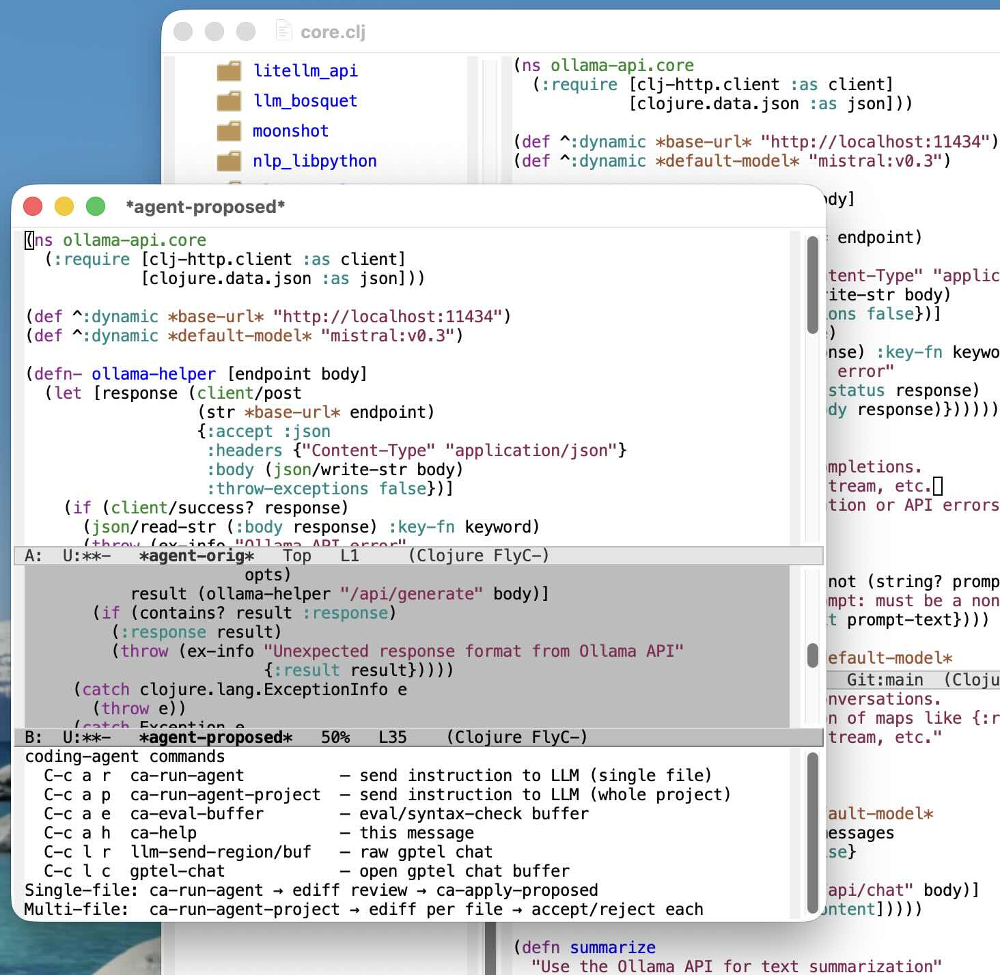

# coding-agent.el

An LLM-powered coding agent for Emacs using [gptel](https://github.com/karthink/gptel).

Make sure you read the material in the documentation directory.

Please note that I used early version of `coding-agent.el` to both develop later versions and to help build the documentation.

## Features

- **Single-file mode**: Send coding instructions to an LLM for the current buffer
- **Multi-file project mode**: Apply changes across an entire project
- **Interactive diff review**: Review proposed changes via ediff before accepting
- **Language-aware**: Automatic detection and evaluation for multiple languages
- **Seamless integration**: Works with your existing gptel backend configuration



## Requirements

- Emacs 29+
- [gptel](https://github.com/karthink/gptel) package
- [straight.el](https://github.com/radian-software/straight.el) (for package installation)
- External tools: `rg` (ripgrep) or `find`, `diff`

## Installation

Place `coding-agent.el` in your load path and add to your configuration:

```elisp
(use-package coding-agent
  :straight (:local-repo "path/to/coding-agent"))
```

## Quick Start

1. Open a source file
2. Run `M-x ca-run-agent` (or `C-c a r`)
3. Enter an instruction (e.g., "add comments", "refactor to use let*")
4. Review the diff in ediff
5. Press `q` and answer `y` to apply changes

## Keybindings

| Key | Command | Description |
|-----|---------|-------------|
| `C-c a r` | `ca-run-agent` | Send instruction for single file |
| `C-c a p` | `ca-run-agent-project` | Send instruction for whole project |
| `C-c a e` | `ca-eval-buffer-for-language` | Evaluate/syntax-check buffer |
| `C-c a h` | `ca-help` | Show help message |
| `C-c l r` | `my-llm-send-region-or-buffer` | Raw gptel chat |
| `C-c l c` | `gptel-chat` | Open gptel chat buffer |

## Supported Languages

Python, Common Lisp, Clojure, JavaScript, TypeScript, Ruby, Go, Rust, C, C++, Java, Emacs Lisp, Shell

## Configuration

The package uses your existing gptel backend. Configure `gptel-backend` and `gptel-model` before using coding-agent.

## License

GPL-3.0
