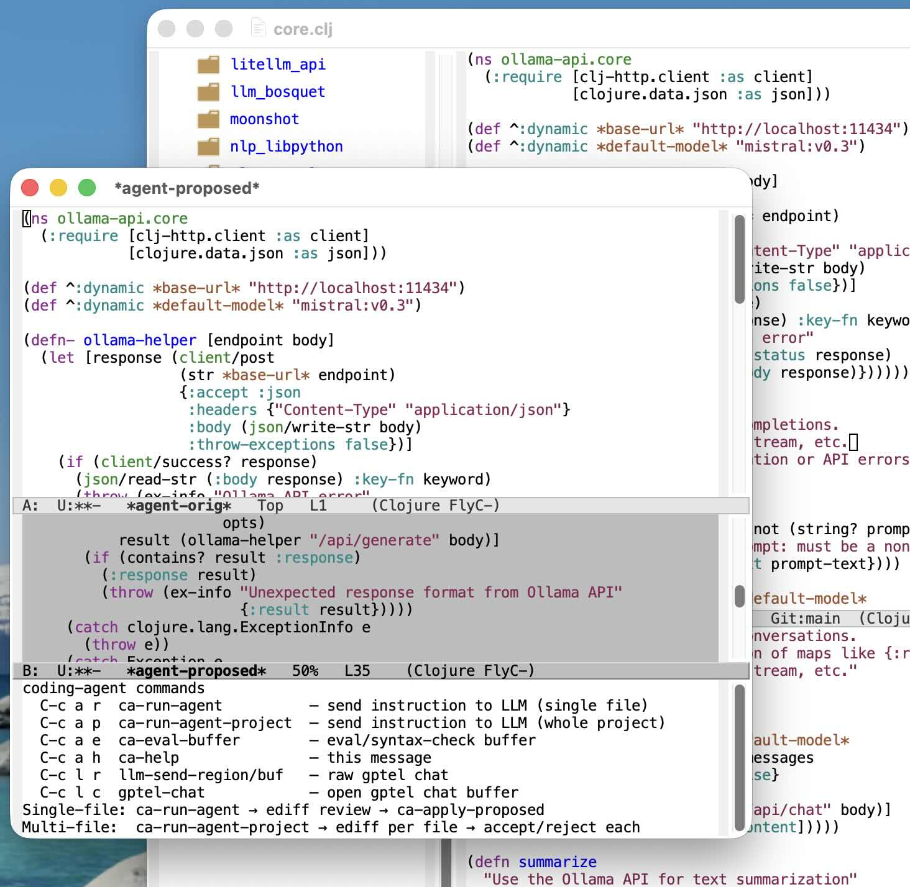

# CODING-AGENT.EL DOCUMENTATION

#### LLM-Powered Coding Agent for Emacs using gptel

TABLE OF CONTENTS
-----------------
1. Overview
2. Features
3. Requirements
4. Installation & Initialization
5. Quick Start
6. Usage Guide
   6.1 Single-File Mode
   6.2 Multi-File Project Mode
   6.3 Refining a Proposal
   6.4 The Response Protocol
   6.5 Reviewing Changes
   6.6 Applying Changes
   6.7 Evaluating / Checking Code
   6.8 Raw Chat Helpers
7. Keybindings Reference
8. Supported Languages
9. Configuration
   9.1 Customization Variables
   9.2 Backend and Model
   9.3 Safety and Privacy
10. Command Reference
11. License

## 1. OVERVIEW

coding-agent.el is an LLM-powered coding agent for Emacs, built on top of the gptel
package. It sends an instruction plus your source code to a language model, shows the
proposed changes as a unified diff (in `*coding-agent-diff*`), and applies them only
after you confirm. Two scopes are supported: a single file (`coding-agent-run`) and a
whole project (`coding-agent-run-project`).

The model may answer with either the COMPLETE new file, or with one or more
search/replace blocks. Search/replace edits are applied by exact match: any block whose
SEARCH text is not found is reported and skipped rather than corrupting the file. When a
response contains no blocks it is treated as a whole-file replacement.

The library configures its own gptel backend. It defaults to Fireworks.ai (model
`accounts/fireworks/models/deepseek-v4-flash`), reading the API key from the
`FIREWORKS_API_KEY` environment variable, and can switch at runtime between Fireworks.ai,
a local Ollama server, and the Anthropic API with `coding-agent-model-change`
(C-c a m). It does not enable its keybindings on load; you call
`(global-coding-agent-mode 1)` in your init.

## 2. FEATURES

- Single-file mode: send coding instructions to an LLM for the current buffer.
- Multi-file project mode: apply changes across an entire project, reviewing each file.
- Two response formats: complete-file rewrite OR search/replace blocks applied by exact
  match, with unmatched blocks skipped (never corrupts the file).
- Iterative refinement: follow up on the last proposal without retyping the request.
- Diff review: proposed changes are shown as a unified diff in `*coding-agent-diff*`
  before anything is written; nothing is saved to disk unless you ask.
- Safety rails: per-file `.coding-agent.bak` backups, a truncated-response guard, an
  optional post-apply delimiter check, a project size cap, and a send-confirmation.
- Privacy filtering: secret files (`.env`, keys, credentials) and binary files are
  never sent to the LLM.
- Language-aware: automatic detection (including tree-sitter modes), evaluation where a
  runtime exists, and delimiter checking elsewhere.
- Multiple providers: defaults to Fireworks.ai and switches at runtime between
  Fireworks.ai, local Ollama, and the Anthropic API (C-c a m), independent of the
  `gptel-backend` used for ordinary chat; Ollama models are read live from `ollama list`.
- Transient command menu.

## 3. REQUIREMENTS

Software:
- Emacs 29.1+
- gptel 0.9+ (https://github.com/karthink/gptel)
- Built-in libraries: cl-lib, diff, diff-mode, transient

External tools:
- rg (ripgrep) — recommended for project file discovery; honors .gitignore.
  If rg is not installed, the agent falls back to `find`.
- diff — used by `diff-no-select` to build the `*coding-agent-diff*` review buffer.
- ollama — optional; when the Ollama (local) provider is chosen, `ollama list` is
  run to offer the installed models.

Credentials (per active provider, read from the environment at request time):
- FIREWORKS_API_KEY — Fireworks.ai (the default provider).
- ANTHROPIC_API_KEY — Anthropic API (also gates whether it appears in the menu).
- Ollama (local) needs no key in Emacs.
Switch the active provider with coding-agent-model-change (C-c a m); see section 9.2.

## 4. INSTALLATION & INITIALIZATION

The library does not bind any keys when it loads; you enable everything with
`global-coding-agent-mode`. The recommended layout keeps personal settings in a small
`coding-agent-config.el` that `~/.emacs` loads.

Step 1 — export the API key from your shell profile so Emacs inherits it:

    export FIREWORKS_API_KEY="fw_..."

Step 2 — load a personal config from ~/.emacs:

    ;;;;;  My coding agent:

    (let ((coding-agent-config "/Users/markw/GITHUB/emacs_setup/coding-agent-config.el"))
      (when (file-exists-p coding-agent-config)
        (load coding-agent-config)))

Step 3 — example coding-agent-config.el:

    ;;; coding-agent-config.el --- personal coding-agent setup -*- lexical-binding: t; -*-

    ;; Make the library discoverable, then load it.
    (add-to-list 'load-path "~/GITHUB/coding-agent")
    (require 'gptel)
    (require 'coding-agent)

    ;; Optional: a backend for ordinary `M-x gptel' chat.  This is independent of the
    ;; agent, which uses its own backend (Fireworks by default; see section 9.2).
    (defvar coding-agent-ollama-backend
      (gptel-make-ollama "Ollama"
        :host "localhost:11434"
        :models '(glm-5:cloud)
        :stream t))
    (setq gptel-backend coding-agent-ollama-backend
          gptel-model 'glm-5:cloud)

    ;; Enable the agent's keybindings everywhere.
    (global-coding-agent-mode 1)

    (provide 'coding-agent-config)

Note: the agent's editing commands route through the agent's own backend (Fireworks by
default), not the global `gptel-backend`; the `setq` above only affects plain
`M-x gptel` usage. Switch the agent's provider with coding-agent-model-change (C-c a m);
see section 9.2.

## 5. QUICK START

1. Open a source file.
2. Run M-x coding-agent-run (or C-c a r).
3. Enter an instruction (e.g., "add docstrings", "refactor to use let* instead of let").
4. Review the change in the *coding-agent-diff* buffer that pops up.
5. Answer y to the "Apply proposed changes to ...?" prompt.

Nothing is written to disk automatically. After applying, the buffer is modified but
unsaved, so you can still inspect or undo before C-x C-s.

## 6. USAGE GUIDE

There are two editing scopes — a single file and a whole project — plus a refine
command for iterating on the previous result.

### 6.1 Single-File Mode

Command: coding-agent-run (C-c a r)

Sends the current buffer's source code to the LLM along with your instruction. The
buffer's language is detected from its major mode. Binary buffers are refused. Example
instructions:
  - "add comments"
  - "refactor to use let* instead of let"
  - "add type hints to all function arguments"

Only one request per buffer may be in flight at a time; a second attempt is refused
until the first returns.

### 6.2 Multi-File Project Mode

Command: coding-agent-run-project (C-c a p)

Collects source files under `default-directory` (recursively), filtered to the current
buffer's language extensions. Uses `rg --files` when available (which also honors
.gitignore), falling back to `find` otherwise.

Files under common build/dependency/VCS directories are pruned automatically
(customizable via `coding-agent-ignore-dirs`), for example:
  - .git, .hg, .svn
  - node_modules, target, vendor
  - __pycache__, .mypy_cache, .tox
  - dist, build, .build, _build
  - .cpcache, .clj-kondo, .lsp
  - .stack-work, .gradle, .venv, .cargo

Secret files and binary files are never sent (see section 9.3). Before sending, the
agent reports the file count and total size and asks for confirmation
(`coding-agent-confirm-project-send`); if the total exceeds
`coding-agent-project-max-bytes` (default ~400 KB) it warns separately.

The LLM returns only the files it changed, delimited by:

    FILE: <relative-path>
    <content or search/replace blocks>
    END_FILE

Each returned file is reviewed individually in sequence (see section 6.5). New files
the model proposes are created on apply.

### 6.3 Refining a Proposal

Command: coding-agent-refine (C-c a f)

Sends a follow-up instruction using the last proposal as the new source, so you can
iterate without retyping the whole request. If there is no stored proposal yet, the
current buffer contents are used as the base.

### 6.4 The Response Protocol

The model is asked to reply with EITHER the complete new file (raw source, no markdown
fences) OR one or more search/replace blocks in exactly this form:

    <<<<<<< SEARCH
    <lines copied verbatim from the current file>
    =======
    <the replacement lines>
    >>>>>>> REPLACE

Rules the agent enforces when applying:
  - SEARCH text must match the current file exactly, whitespace included.
  - Blocks are applied by exact string search. A single trailing-newline mismatch at
    end of file is tolerated.
  - Any block whose SEARCH text is not found is reported ("N search block(s) did not
    match") and skipped; the remaining blocks are still applied.
  - A response with no blocks is treated as a whole-file replacement, after markdown
    fences (if any) are stripped.

### 6.5 Reviewing Changes

When the LLM responds, these buffers are populated:
  - *coding-agent-diff*      — a read-only unified diff (diff-mode) of the original vs
                               the proposed result; this is the buffer you review
  - *coding-agent-raw*       — the raw model reply (single-file mode)
  - *coding-agent-project-raw* — the raw model reply (project mode)

The *coding-agent-diff* buffer is displayed automatically (no ediff session, no
proposed-buffer pop-up). It is reused across runs and left open, so you can find it in
the buffer list and read it at any time. For multi-file responses each modified file is
reviewed in sequence, its diff shown in the same buffer before that file's prompt,
allowing an independent accept/reject decision per file.

### 6.6 Applying Changes

Option A (prompt):
  Read the *coding-agent-diff* buffer, then answer y to the "Apply proposed changes to
  <buffer>?" prompt.

Option B (deferred): M-x coding-agent-apply-proposed  (C-c a a)
  Answer n to the prompt to skip for now, then apply later; this applies the proposal
  stashed for the current buffer during the last run.

On apply, the buffer text is replaced but the file is NOT saved unless you set
`coding-agent-apply-saves-buffer`. Before writing, the file is copied to
FILE.coding-agent.bak (unless `coding-agent-backup-on-apply` is nil). If a whole-file
proposal is smaller than `coding-agent-min-proposed-ratio` of the original (default
0.5), you are asked to confirm — a guard against truncated responses. When
`coding-agent-check-after-apply` is non-nil, a delimiter balance check runs afterwards
on lisp-family code and offers to revert if it fails.

### 6.7 Evaluating / Checking Code

Command: coding-agent-eval-buffer-for-language (C-c a e)

Runs the appropriate checker/evaluator for the buffer's language:
  - Python       -> python-shell-send-buffer
  - Common Lisp  -> slime-compile-and-load-file
  - Clojure      -> cider-load-buffer
  - Emacs Lisp   -> eval-buffer
  - other        -> delimiter balance check (reports whether parens/brackets balance)

If the tool for a language (SLIME, CIDER, python-mode) is not available, a message
says so rather than erroring.

### 6.8 Raw Chat Helpers

These talk to the same Fireworks backend but bypass the edit/review machinery.

Command: coding-agent-send-region-or-buffer (C-c l r)
  Sends the active region, or the whole buffer, as a raw request and shows the reply in
  *coding-agent-chat-output*.

Command: coding-agent-open-chat (C-c l c)
  Opens (or switches to) a gptel chat buffer named *coding-agent-chat* bound to the
  Fireworks backend.

## 7. KEYBINDINGS REFERENCE

Active when coding-agent-mode (or global-coding-agent-mode) is on.

| Key     | Command                                | Description                     |
|---------|----------------------------------------|---------------------------------|
| C-c a r | coding-agent-run                       | Edit the current file           |
| C-c a p | coding-agent-run-project               | Edit across the project         |
| C-c a f | coding-agent-refine                    | Follow-up on the last result    |
| C-c a a | coding-agent-apply-proposed            | Apply the stashed proposal      |
| C-c a e | coding-agent-eval-buffer-for-language  | Evaluate / syntax-check buffer  |
| C-c a . | coding-agent-dispatch                  | Transient command menu          |
| C-c a m | coding-agent-model-change              | Switch provider / model         |
| C-c a h | coding-agent-help                      | Show the cheatsheet             |
| C-c l r | coding-agent-send-region-or-buffer     | Raw request (region/buffer)     |
| C-c l c | coding-agent-open-chat                 | Open a gptel chat buffer        |

## 8. SUPPORTED LANGUAGES

Language        | Extensions
----------------|---------------------------
Python          | .py, .pyi
Common Lisp     | .lisp, .cl, .asd
Clojure         | .clj, .cljs, .cljc, .edn
JavaScript      | .js, .mjs, .cjs, .jsx
TypeScript      | .ts, .tsx
Ruby            | .rb
Go              | .go
Rust            | .rs
C               | .c, .h
C++             | .cpp, .cc, .cxx, .hpp, .hh
Java            | .java
Emacs Lisp      | .el
Hy              | .hy
Markdown        | .md
Shell           | .sh, .bash, .zsh

Tree-sitter major modes (python-ts-mode, js-ts-mode, rust-ts-mode, ...) are recognized
alongside their classic counterparts.

## 9. CONFIGURATION

### 9.1 Customization Variables

Most options live in the `coding-agent` customize group
(M-x customize-group RET coding-agent).

| Variable                          | Default                                        | Purpose                                                        |
|-----------------------------------|------------------------------------------------|----------------------------------------------------------------|
| coding-agent-model                | accounts/fireworks/models/deepseek-v4-flash    | Model the agent sends requests to                              |
| coding-agent-backend              | Fireworks.ai backend                           | gptel backend used for every agent request (a defvar)          |
| coding-agent-apply-saves-buffer   | nil                                            | Save automatically after applying a proposal                   |
| coding-agent-backup-on-apply      | t                                              | Copy FILE to FILE.coding-agent.bak before applying             |
| coding-agent-min-proposed-ratio   | 0.5                                            | Confirm before applying whole-file output smaller than this    |
| coding-agent-check-after-apply    | nil                                            | Run a delimiter check after applying and offer to revert       |
| coding-agent-project-max-bytes    | 409600 (400 KB)                                | Confirm before sending a project larger than this many bytes   |
| coding-agent-confirm-project-send | t                                              | Ask before sending project files to the LLM                    |
| coding-agent-ignore-dirs          | build/VCS directory names                      | Directory names pruned when collecting project files           |
| coding-agent-secret-globs         | .env, *.pem, *.key, *credential*, *secret*, .. | Filename globs never sent to the LLM in project mode           |

### 9.2 Backend, Model, and Provider Switching

Every request routes through an internal helper that binds `gptel-backend` to
`coding-agent-backend` and `gptel-model` to `coding-agent-model`, so a global
`gptel-backend` set for other gptel usage never changes which provider the agent uses.
The provider defaults to Fireworks.ai.

Command: coding-agent-model-change (C-c a m)
  Switches the provider and model at runtime. Three providers are built in:

    Provider        Backend                                API-key variable
    --------------- -------------------------------------- --------------------
    Fireworks.ai    api.fireworks.ai (OpenAI-compatible)   FIREWORKS_API_KEY
    Ollama (local)  localhost:11434                        (none)
    Anthropic API   Anthropic                              ANTHROPIC_API_KEY

  A provider is only offered when its API-key variable is set; providers that need no
  key are always available. So Anthropic appears only once ANTHROPIC_API_KEY is
  exported. The key is read from the environment at request time; if the active
  provider's variable is unset, the command aborts with a message naming it.

  When Ollama (local) is chosen, its model list is read live from `ollama list`, so you
  pick among the models you have actually pulled (this needs the `ollama' executable on
  PATH; if it is missing or fails, the static fallback list is offered instead). For
  every provider the model prompt also accepts a name that is not in the list, so you
  can use any model it serves. The static lists are `coding-agent-fireworks-models`,
  `coding-agent-ollama-local-models` (fallback only), and `coding-agent-anthropic-models`.

  Local Ollama requests also raise the context window: `coding-agent-ollama-num-ctx`
  (default 16336) is sent as options.num_ctx through the backend's request-params, since
  Ollama's small default context would otherwise truncate whole-file prompts.

To add or reshape providers, edit `coding-agent--providers`; each entry names a label,
a `gptel-make-*` backend, a model list, and an optional key variable.

### 9.3 Safety and Privacy

- Secret files are never sent. `coding-agent-secret-globs` matches names such as
  .env, *.env, .env.*, *.pem, *.key, *.p12, *.pfx, *.pkcs12, id_rsa, id_dsa,
  id_ecdsa, id_ed25519, *credential*, and *secret*.
- Binary files are never sent. Only files with a known text extension (or no
  extension, e.g. Makefile) are collected.
- Backups: FILE.coding-agent.bak is written before each apply (unless disabled).
- Truncation guard: a whole-file proposal smaller than the original by more than
  `coding-agent-min-proposed-ratio` requires explicit confirmation.
- Deferred save: applying never writes to disk unless `coding-agent-apply-saves-buffer`
  is non-nil; you review the modified buffer and save yourself.
- Size cap and send-confirmation for project mode (sections 6.2 / 9.1).

## 10. COMMAND REFERENCE

coding-agent-run (INSTRUCTION)
  Send INSTRUCTION about the current source buffer to the LLM. Refuses binary buffers
  and buffers with a request already in flight.

coding-agent-run-project (INSTRUCTION)
  Send INSTRUCTION about the whole project to the LLM. Collects source files under
  default-directory matching the current buffer's language, warns about size, confirms,
  and reviews each returned file.

coding-agent-refine (INSTRUCTION)
  Send a follow-up INSTRUCTION using the last proposal (or the current buffer) as the
  new source.

coding-agent-apply-proposed
  Apply the proposal stashed for the current buffer during the last run.

coding-agent-eval-buffer-for-language
  Run the appropriate eval/check for the current buffer's language (section 6.7).

coding-agent-model-change
  Switch the provider and model the agent uses (section 9.2). Only providers whose
  API-key variable is set are offered.

coding-agent-send-region-or-buffer
  Send the region, or the whole buffer, as a raw request and show the reply.

coding-agent-open-chat
  Open (or switch to) a gptel chat buffer on the Fireworks backend.

coding-agent-dispatch
  Open the transient command menu.

coding-agent-help
  Display a short usage cheatsheet in the echo area.

coding-agent-mode / global-coding-agent-mode
  Minor mode (and its globalized form) that install the C-c a / C-c l keybindings.

## 11. LICENSE

GPL-3.0 Licensed
